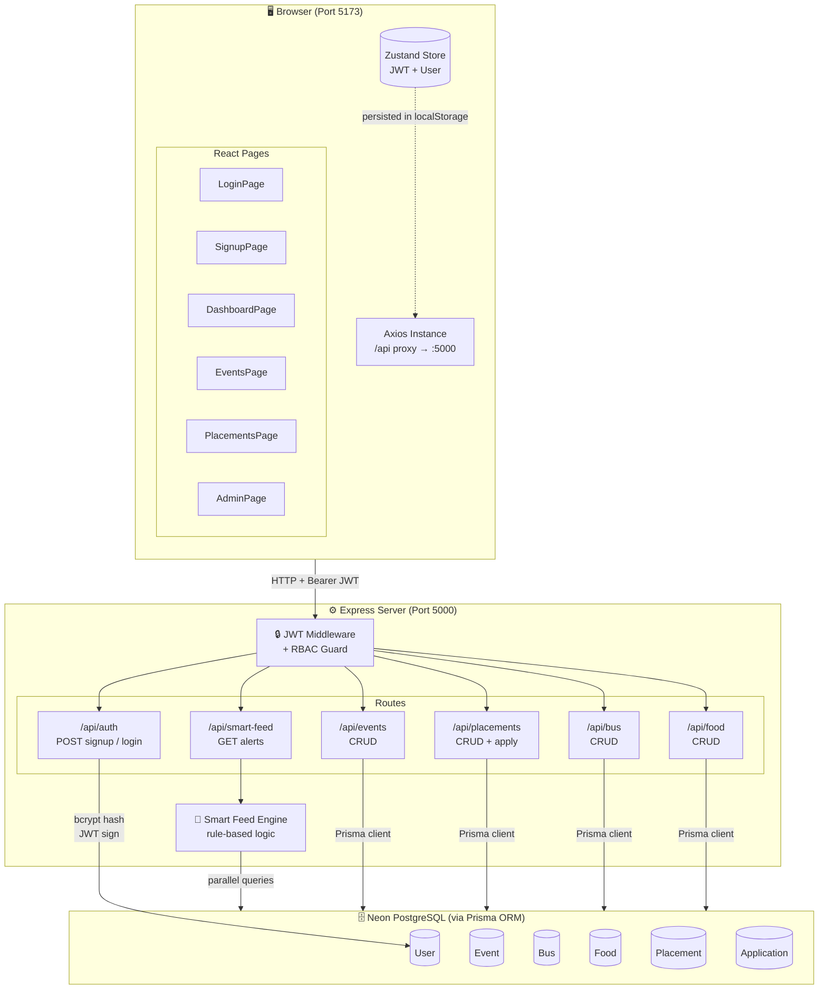
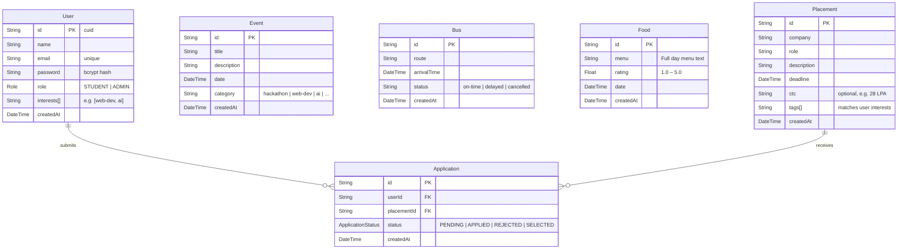

<div align="center">

# 🎓 CampusCare
### Smart Campus Assistant

*A centralized, full-stack campus platform that eliminates information fragmentation by delivering a personalized, rule-based **Smart Feed** of prioritized alerts for placements, buses, events and mess.*

[](https://nodejs.org)
[](https://react.dev)
[](https://vitejs.dev)
[](https://neon.tech)
[](https://prisma.io)
[](https://tailwindcss.com)

</div>

---

## 📋 Table of Contents

1. [Problem Statement](#-problem-statement)
2. [Features Overview](#-features-overview)
3. [Architecture](#-architecture)
4. [Data Flow](#-data-flow)
5. [Smart Feed Engine](#-smart-feed-engine)
6. [Database Schema](#-database-schema)
7. [Project Structure](#-project-structure)
8. [UI Pages](#-ui-pages)
9. [API Reference](#-api-reference)
10. [Roles & Access Control](#-roles--access-control)
11. [Tech Stack](#-tech-stack)
12. [Setup & Running](#-setup--running)
13. [Environment Variables](#-environment-variables)
14. [Demo Accounts & Seeded Data](#-demo-accounts--seeded-data)

---

## 🧩 Problem Statement

Campus life is chaotic. Information is scattered:

- 📢 Placement deadlines get buried in long email threads
- 🚌 No real-time awareness of bus timings until you've missed one
- 🎪 Events go unnoticed because they're posted on random notice boards
- 🍱 Students don't know if the mess is good or bad until they're already there

**CampusCare** brings all of this into one clean dashboard and, more importantly, uses a **rule-based Smart Feed engine** to surface only the alerts that *actually matter right now*, prioritized by urgency and personalized to each student's interests.

---

## ✨ Features Overview

| Module | What it does |
|--------|-------------|
| 🧠 **Smart Feed** | Rules engine surfaces urgent, medium, and normal alerts from all data sources |
| 📅 **Events** | Browse, filter by category, and search upcoming campus events |
| 💼 **Placements** | Track companies, deadlines, apply directly; dedicated applied state |
| 🚌 **Bus Tracker** | See bus arrival times and on-time status |
| 🍽️ **Mess Menu** | View today's menu and quality rating |
| ⚙️ **Admin Panel** | Full CRUD panel for all modules; tabbed UI with modal forms |
| 🔐 **Auth** | JWT-based login/signup with role-based route protection |
| 🎯 **Personalization** | Students pick interests at signup; Smart Feed uses them to rank alerts |

---

## 🏗️ Architecture



---

## 🔄 Data Flow

### Login Flow
```
User fills form → POST /api/auth/login
  → bcrypt.compare(password, hash)
  → jwt.sign({ id, email, role, name })
  → Token stored in Zustand (persisted to localStorage)
  → Axios interceptor auto-attaches Bearer header on all future requests
```

### Smart Feed Flow
```
Dashboard mounts → GET /api/smart-feed
  → JWT verified by middleware
  → Fetch user.interests from DB
  → Parallel fetch: placements, buses, events, foods
  → Rule engine evaluates each item:
      • deadline < 2h  → HIGH priority alert
      • bus < 8 mins   → HIGH priority alert
      • event < 3h     → HIGH priority alert
      • rating < 2.5   → MEDIUM alert
  → Filter by user.interests (personalization)
  → Sort: HIGH → MEDIUM → LOW
  → Return { alerts[], stats: { high, medium, low, total } }
  → Dashboard renders color-coded AlertCards
```

### Apply to Placement Flow
```
Student clicks "Apply Now" → POST /api/placements/:id/apply
  → Middleware checks role = STUDENT
  → Prisma upsert Application { userId, placementId, status: APPLIED }
  → Frontend updates local state (no refetch needed)
  → Button changes to ✅ Applied
```

---

## 🧠 Smart Feed Engine

Located at `backend/src/routes/smartFeed.js`, the engine is a pure function `generateAlerts(placements, buses, events, foods, userInterests)` that returns an array of alert objects.

### Alert Object Shape
```json
{
  "id": "placement-urgent-clxyz",
  "type": "placement",
  "priority": "HIGH",
  "emoji": "🔥",
  "title": "Amazon deadline in 90 minutes!",
  "message": "SDE-1 (Backend) | 28 LPA — Apply NOW!",
  "refId": "clxyz",
  "createdAt": "2026-03-27T08:25:00.000Z"
}
```

### Priority Rules Table

| Source | Condition | Priority | Color |
|--------|-----------|----------|-------|
| Placement | Deadline `< 2h` AND user interested | 🔴 HIGH | Red |
| Placement | Deadline `< 24h` AND user interested | 🟡 MEDIUM | Yellow |
| Placement | Deadline `> 24h` AND user interested | 🟢 LOW | Green |
| Bus | Arrival `< 8 mins` | 🔴 HIGH | Red |
| Bus | Arrival `8–20 mins` | 🟡 MEDIUM | Yellow |
| Event | Starts in `< 3h` | 🔴 HIGH | Red |
| Event | In `< 24h` AND user interested | 🟡 MEDIUM | Yellow |
| Event | Future AND user interested | 🟢 LOW | Green |
| Food | Rating `< 2.5` | 🟡 MEDIUM | Yellow |
| Food | Rating `≥ 4.0` | 🟢 LOW | Green |

> Alerts are sorted `HIGH → MEDIUM → LOW` before returning to the client.

### Personalization Logic
```javascript
const isInterested =
  userInterests.length === 0 ||        // No interests set = see everything
  p.tags.some(tag => userInterests.includes(tag));  // Match any tag
```

---

## 🗄️ Database Schema



---

## 📁 Project Structure

```
Indira/
├── README.md
│
├── backend/                         ← Node.js + Express API
│   ├── .env                         ← DATABASE_URL, JWT_SECRET, PORT
│   ├── .env.example                 ← Template for .env
│   ├── package.json
│   ├── prisma/
│   │   ├── schema.prisma            ← All Prisma models and enums
│   │   └── seed.js                  ← Seeds 3 users, 5 events, 4 buses,
│   │                                   2 menus, 4 placements, 1 application
│   └── src/
│       ├── index.js                 ← Express app, CORS, route mounting
│       ├── lib/
│       │   └── prisma.js            ← Prisma singleton (avoids hot-reload issues)
│       ├── middleware/
│       │   └── auth.js              ← authenticate() + requireAdmin()
│       └── routes/
│           ├── auth.js              ← POST /signup, /login · GET /me
│           ├── events.js            ← CRUD /events
│           ├── bus.js               ← CRUD /bus
│           ├── food.js              ← CRUD /food
│           ├── placements.js        ← CRUD /placements + POST /:id/apply
│           └── smartFeed.js         ← GET /smart-feed (rule engine lives here)
│
└── frontend/                        ← React + Vite SPA
    ├── index.html                   ← Root HTML (Inter font, SEO meta tags)
    ├── vite.config.js               ← Tailwind v4 plugin + /api proxy
    └── src/
        ├── App.jsx                  ← BrowserRouter with all routes
        ├── main.jsx                 ← ReactDOM.createRoot entry
        ├── index.css                ← Design system: CSS vars, utility classes
        │
        ├── lib/
        │   └── api.js               ← Axios instance (auto JWT, 401 redirect)
        │
        ├── store/
        │   └── authStore.js         ← Zustand store: login, signup, logout
        │                               Persisted via zustand/middleware persist
        │
        ├── components/
        │   ├── Navbar.jsx           ← Sticky nav, bell badge, user dropdown
        │   └── ProtectedRoute.jsx   ← <ProtectedRoute> and <AdminRoute> guards
        │
        └── pages/
            ├── LoginPage.jsx        ← Email/pass form + demo quick-fill buttons
            ├── SignupPage.jsx        ← Form + interest tag picker (7 options)
            ├── DashboardPage.jsx    ← Smart Feed alerts + stat cards + sidebar
            ├── EventsPage.jsx       ← Category pills, search, time-left countdown
            ├── PlacementsPage.jsx   ← Cards with apply, CTC, deadline badge
            └── AdminPage.jsx        ← Tabs: Events | Bus | Food | Placements
                                        Each tab has Add (modal) + Delete
```

---

## 📱 UI Pages

### Login Page (`/login`)
- Email + password form with show/hide password toggle
- **Quick Demo buttons** — auto-fill Student or Admin credentials
- Link to Signup

### Signup Page (`/signup`)
- Name, email, password fields
- **Interest tag picker** — 7 clickable tags (Web Dev, AI/ML, Hackathon, Finance, Consulting, Cultural, Backend)
- Selected interests power Smart Feed personalization

### Dashboard (`/dashboard`)
- **Greeting** with time-of-day salutation
- **4 stat cards** — Urgent Alerts, Events, Placements, Buses (linked)
- **Smart Feed** — sorted alert cards with emoji, title, message, priority badge
  - 🔴 Red border = HIGH  · 🟡 Yellow = MEDIUM  · 🟢 Green = LOW
  - Refresh button to re-fetch
  - Pulsing red badge on navbar bell for urgent count
- **Sidebar** — Quick links + Alert breakdown summary

### Events Page (`/events`)
- Category filter pills (All / Hackathon / Web-Dev / AI / Cultural / Finance)
- Search bar (title + description)
- Cards showing category badge, time-left countdown, date/time

### Placement Tracker (`/placements`)
- Company avatar initial, role, description, CTC badge
- Deadline countdown — color coded by urgency
- **Apply Now** button (Student only) → changes to ✅ Applied after click
- Applied counter shown in page header

### Admin Panel (`/admin`) — Admin only
- **Tabs**: Events · Bus · Food · Placements
- Each tab: list of existing items + Add button → modal form
- Delete with confirmation prompt

---

## 📡 API Reference

### Auth — Public
| Method | Endpoint | Body | Response |
|--------|----------|------|----------|
| `POST` | `/api/auth/signup` | `{ name, email, password, interests[] }` | `{ token, user }` |
| `POST` | `/api/auth/login` | `{ email, password }` | `{ token, user }` |
| `GET`  | `/api/auth/me` | — *(Bearer token)* | `{ id, name, email, role, interests }` |

### Smart Feed — Authenticated
| Method | Endpoint | Response |
|--------|----------|----------|
| `GET` | `/api/smart-feed` | `{ alerts[], stats: { total, high, medium, low } }` |

### Events — GET: Any · POST/PUT/DELETE: Admin
| Method | Endpoint | Description |
|--------|----------|-------------|
| `GET`    | `/api/events` | List all. Optional `?category=hackathon` filter |
| `GET`    | `/api/events/:id` | Single event |
| `POST`   | `/api/events` | `{ title, description, date, category }` |
| `PUT`    | `/api/events/:id` | Partial update |
| `DELETE` | `/api/events/:id` | Remove event |

### Placements — GET: Any · Mutations: Admin/Student
| Method | Endpoint | Auth | Description |
|--------|----------|------|-------------|
| `GET`    | `/api/placements` | Any | Includes `applicationStatus` for students |
| `POST`   | `/api/placements` | Admin | `{ company, role, description, deadline, ctc, tags[] }` |
| `PUT`    | `/api/placements/:id` | Admin | Partial update |
| `DELETE` | `/api/placements/:id` | Admin | Delete |
| `POST`   | `/api/placements/:id/apply` | Student | Apply; upserts Application row |

### Bus — GET: Any · Mutations: Admin
| Method | Endpoint | Description |
|--------|----------|-------------|
| `GET`    | `/api/bus` | All routes, sorted by arrival time |
| `POST`   | `/api/bus` | `{ route, arrivalTime, status }` |
| `PUT`    | `/api/bus/:id` | Partial update |
| `DELETE` | `/api/bus/:id` | Delete |

### Food — GET: Any · Mutations: Admin
| Method | Endpoint | Description |
|--------|----------|-------------|
| `GET`    | `/api/food` | Latest 5 menu entries |
| `POST`   | `/api/food` | `{ menu, rating }` |
| `PUT`    | `/api/food/:id` | Partial update |
| `DELETE` | `/api/food/:id` | Delete |

---

## 👥 Roles & Access Control

JWT payload: `{ id, email, name, role }` — role is either `STUDENT` or `ADMIN`.

| Feature | Student | Admin |
|---------|:-------:|:-----:|
| Login / Signup | ✅ | ✅ |
| View Smart Feed | ✅ | ✅ |
| View Events, Bus, Food, Placements | ✅ | ✅ |
| Apply to placements | ✅ | ❌ |
| Create events / bus / food / placements | ❌ | ✅ |
| Edit existing records | ❌ | ✅ |
| Delete records | ❌ | ✅ |
| Access `/admin` page | ❌ | ✅ |

Enforcement is done in two layers:
1. **`authenticate` middleware** — verifies JWT on every protected route
2. **`requireAdmin` middleware** — additionally checks `role === 'ADMIN'`

---

## 🛠️ Tech Stack

| Layer | Technology | Why |
|-------|-----------|-----|
| **Frontend** | React 18 + Vite 8 | Fast HMR, modern JSX |
| **Styling** | Tailwind CSS v4 | Utility-first, zero-config with `@tailwindcss/vite` |
| **Icons** | lucide-react | Consistent, tree-shakeable icon set |
| **State** | Zustand + `persist` | Lightweight; auth survives page refresh |
| **HTTP** | Axios | Interceptors for auto JWT attach + 401 logout |
| **Routing** | React Router v7 | Declarative routes, nested protection |
| **Backend** | Node.js + Express | Minimal, fast REST API |
| **Database** | PostgreSQL on Neon | Serverless, free tier, SSL |
| **ORM** | Prisma v5 | Type-safe queries, auto migrations |
| **Auth** | JWT + bcryptjs | Stateless, secure password hashing |
| **Font** | Inter (Google Fonts) | Clean, modern, professional |

---

## 🚀 Setup & Running

### Prerequisites

- **Node.js** v18 or higher
- **npm** v9+
- A free **[Neon DB](https://neon.tech)** account (PostgreSQL)

---

### Step 1: Clone & Open

```bash
git clone <your-repo-url>
cd Indira
```

---

### Step 2: Configure Backend

```bash
cd backend
npm install
```

Copy the example env file and fill in your Neon DB URL:

```bash
cp .env.example .env
```

Edit `backend/.env`:

```env
# Get this from neon.tech → your project → Connection string → Prisma
DATABASE_URL="postgresql://<user>:<password>@<host>.neon.tech/<dbname>?sslmode=require"

# Any random long string for JWT signing
JWT_SECRET="campuscare-super-secret-jwt-key-2024"

PORT=5000
```

---

### Step 3: Push Schema & Seed Database

```bash
# Create all tables in your Neon DB
npx prisma db push

# Seed with demo users, events, placements, buses, food
node prisma/seed.js
```

Expected seed output:
```
🌱 Seeding database...
✅ Users created
✅ Events created
✅ Bus timings created
✅ Food menu created
✅ Placements created
✅ Applications created

🎉 Seed complete!
```

---

### Step 4: Start Backend

```bash
npm run dev
# → 🚀 CampusCare backend running on http://localhost:5000
```

---

### Step 5: Setup & Start Frontend

```bash
cd ../frontend
npm install
npm run dev
# → http://localhost:5173
```

> The Vite dev server automatically proxies `/api/*` → `http://localhost:5000`. No extra configuration needed.

---

## 🔐 Environment Variables

| Variable | Location | Required | Description |
|----------|----------|----------|-------------|
| `DATABASE_URL` | `backend/.env` | ✅ Yes | Neon PostgreSQL connection string |
| `JWT_SECRET` | `backend/.env` | ✅ Yes | Secret for signing JWT tokens (min 32 chars recommended) |
| `PORT` | `backend/.env` | ❌ No | Backend port (default: `5000`) |

---

## 🧪 Demo Accounts & Seeded Data

### Accounts

| Role | Email | Password | Interests |
|------|-------|----------|-----------|
| 🎓 Student | `arjun@campus.edu` | `student123` | web-dev, ai, hackathon |
| 🎓 Student | `priya@campus.edu` | `student123` | finance, consulting |
| ⚙️ Admin | `admin@campus.edu` | `admin123` | — |

> **Tip:** The login page has **Quick Demo buttons** that autofill Student or Admin credentials with one click.

### Seeded Records

| Type | Count | Notes |
|------|-------|-------|
| Users | 3 | 1 admin, 2 students with different interests |
| Events | 5 | Hackathon (tomorrow), Web Workshop (3 days), AI Seminar (2h), Cultural Fest (1 week), Finance Club |
| Bus Routes | 4 | Arrivals at 5 min, 20 min, 45 min, 90 min from seed time |
| Food Menus | 2 | One low-rating (2.1 → triggers MEDIUM alert), one high-rating (4.2) |
| Placements | 4 | Amazon (2h deadline → HIGH), Google (1 day), Goldman Sachs (3 days), McKinsey (1 week) |
| Applications | 1 | Arjun already applied to Google |

> Dates are seeded **relative to the time you run `seed.js`** so the Smart Feed alerts are always fresh and accurate.

---

## 🔮 Potential Enhancements

- [ ] WebSocket / SSE for real-time Smart Feed updates
- [ ] Email / push notifications for high-priority alerts
- [ ] "Missed Opportunities" tracker (expired deadlines you didn't act on)
- [ ] Analytics dashboard (alert counts, apply rates)
- [ ] Student profile page with interest editing
- [ ] Dark / light theme toggle

---

<div align="center">

Built with ❤️ for the hackathon · **CampusCare** © 2026

</div>
